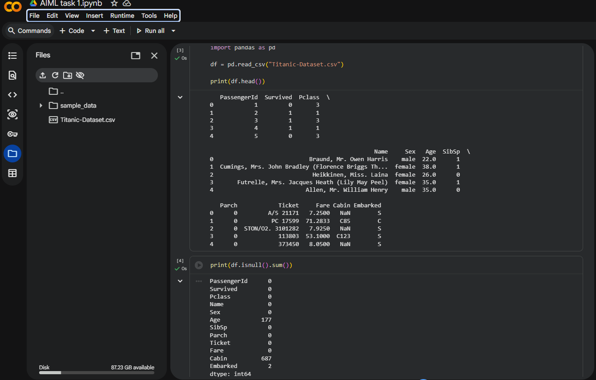
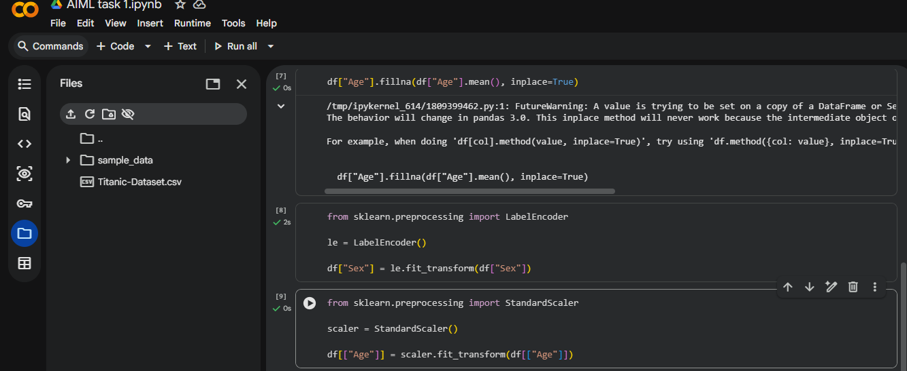
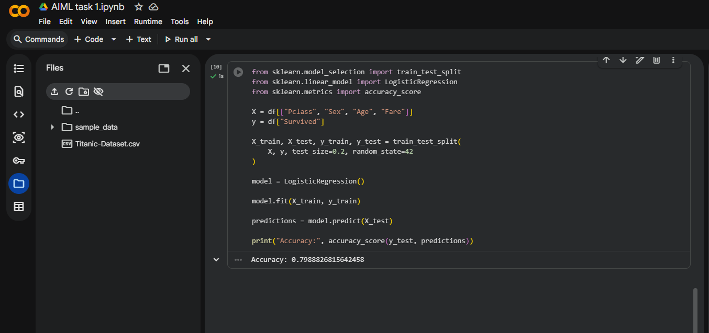

# Dataset Preprocessing Project

## Objective
The objective of this project is to preprocess and clean data for machine learning using feature engineering and preprocessing techniques.

## Dataset Used
Titanic Dataset

## Steps Performed
- Loaded dataset using pandas
- Checked missing values
- Filled missing values
- Encoded categorical data
- Scaled numerical features
- Split data into training and testing sets
- Trained Logistic Regression model
- Evaluated model accuracy

## Libraries Used
- pandas
- numpy
- scikit-learn

## Output
Successfully preprocessed the dataset and trained a machine learning model with good accuracy.

## Screenshots

### Dataset Preview and Missing values

### Handling Missing values

### Model Accuracy

